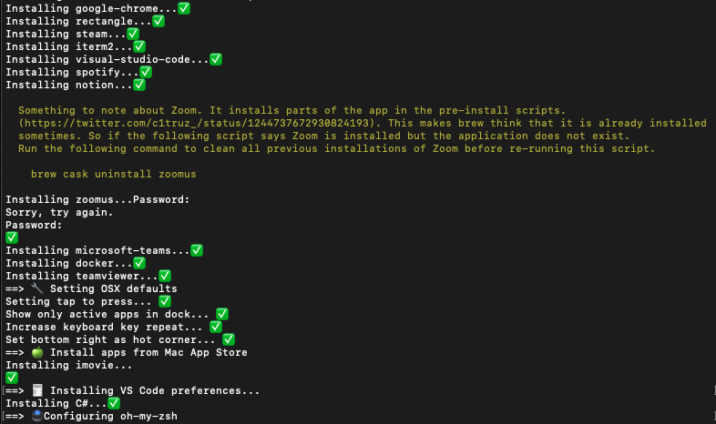

# Mac Starter 

I usually love to tear down my laptop from time to time and re-install everything. I don't know why but I'd like to keep my setup clean and lean. And I find it easy to just start from scratch rather than figuring out what is installed and keep cleaning them. 

Recently I realised that I'm doing mundane things of re-installing applications which was not fun. So I wanted to automate the whole process and this repository contains the scripts needed to do that.

## Goal

I'd like to reach a state where after setup a new Macbook I just download script from Github and run it and go make a cup of coffee ☕️ and come back to see everything that I need ready. It should look something like at the end.

## Software

I use my Mac mainly for development and playing some games on Steam. So it's going to be minimal setup with contains the following softwares.

- Homebrew
- Google Chrome
- Rectangle
- iTerm2
- Visual Studio Code
- Spotify 
- Notion
- Slack
- Microsoft Teams
- Zoom
- Team Viewer
- Onedrive
- Yammer
- IntelliJ Ultimate

## Development Environment

- Docker
- Java
- Go@1.14
- gradle
- Oh-My-Zsh
- SSH keys
- nvm
- CockroachDB
- Postman

## Command Line

- jq 
- tree

## OSX Settings

I've changed the following behaviours in OSX

- Change tap to press - By default I need to press to press 🙄
- Show only active items in dock - I don't like clutter.
- Increase keyrepeat and delay keyrepeat delay - I assume most devs like it this way.
- Add bottom right corner as hot corner for locking screen

# Mac App Store

I'm using [mas-cli](https://github.com/mas-cli/mas) to automate installation for the following apps. This installation uses ids listed in `mas search <app>` command to ensure the correct app is installed. It also skips installation if the app is already present.

- iMovie

---

## Future work.

- Programming languages & frameworks like Python, .NET Core based on necessity. Also configurations of tools & apps like vimrc files and IntelliJ configuration files.

There is some level of automation which might be possible but I've not attempted to do it, like extensions in Chrome. Maybe something that I might attempt sometime in the future.